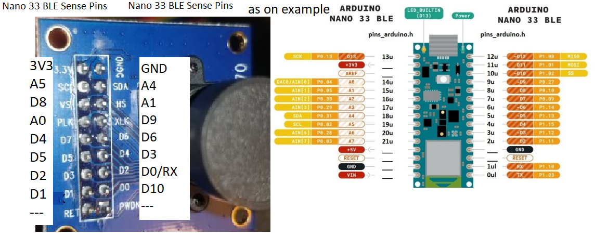

Started Jan 4th, 2021

All files to use the OV7670 camera with the Nano33 BLE SENSE and hopefully later the Porttenta Vision Shield

The main file to run is the [nanoCamOV7670.ino](nanoCamOV7670.ino) possible a new version if it is there.

the main arduino library is the zipped [ei-ov7670-02-detect-micro-arduino-1.0.9.zip](ei-ov7670-02-detect-micro-arduino-1.0.11.zip)

The other files were used to get the camera working properly.

