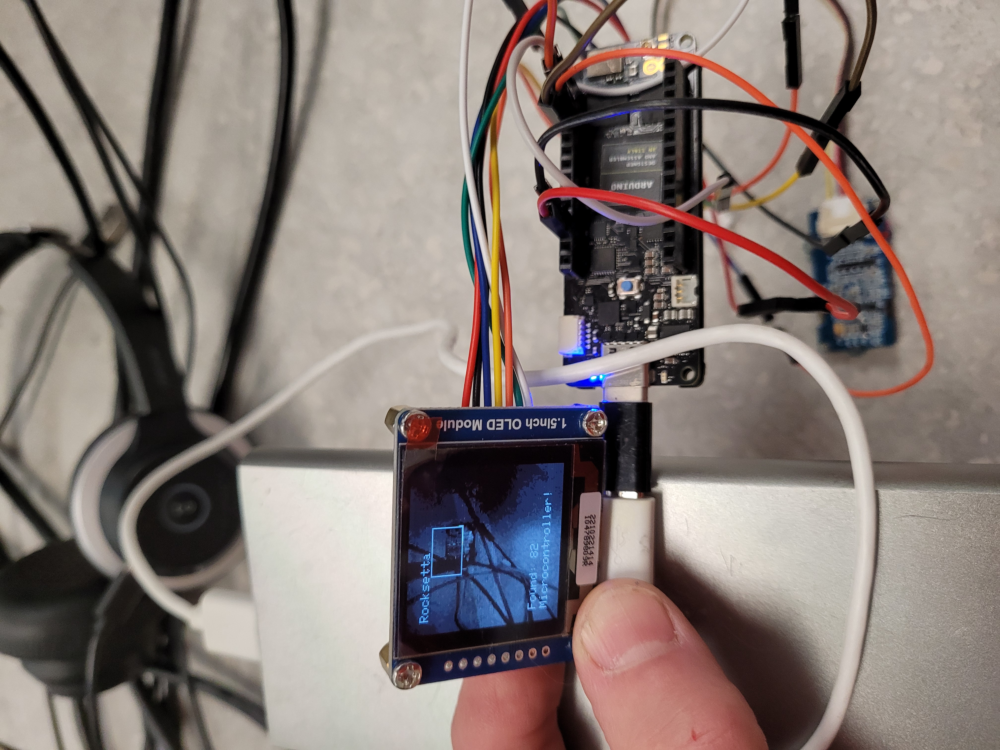

Just another folder as my other one was getting full. This one uses the GRAYSCALE 128x128 1.5 inch waveshare OLED and the new 2.5.2 
verison of Portenta software that allows memory sharing between the cores but does not increase the heap meaning presently our models can't be much bigger

looking into squish instead of cutout ways to look at the image

https://www.waveshare.com/1.5inch-oled-module.htm

WORKING   [works](b01-edge48-96x96-model-regular-gray-128x128-oled-count-results.ino)

https://github.com/hpssjellis/my-examples-of-edge-impulse/blob/main/PortentaVisionShield/research-late-sept-2021-grayscale-oled/b01-edge48-96x96-model-regular-gray-128x128-oled-count-results.ino

Note: I tried this one on 320x320 Arduino Portenta Camera and it failed

b44-BAD-gray-128x128-oled-320x320-camera.ino

I filed an issue with arduino mbed core

https://github.com/arduino/ArduinoCore-mbed

https://github.com/arduino/ArduinoCore-mbed/issues/336

So now I need help from EdgeImpulse I think this is a good as I can hope at the moment.

96x96 Edge Impulse model using a Portenta vision shield 320x240 camera shown on a 1.5 inch 128x128 Grayscale OLED by waveshare.

