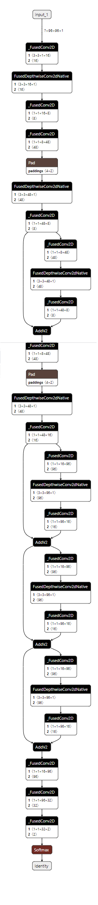

Connected to this thread


**https://forum.edgeimpulse.com/t/advanced-vision-fomo-adding-keras-layers/4549/**


That is not working weell so lets try tensoflowJS


https://github.com/hpssjellis/my-examples-for-the-arduino-portentaH7/tree/master/m09-Tensoflow/tfjs-convert-to-arduino-header


The pre-designed gitpod for converting tensorflow to tensorflowjs is here   https://gitpod.io/#github.com/hpssjellis/Gitpod-auto-tensorflowJS-to-arduino

The bash file I used is ```edge-to-tfjs.sh``` and the output folder is ```tfjs-layers``` which has the SHARD file and the JSON file

note: I actually used the tensorflowjs_wizard to make the layers files

A html link to that folder is 

https://hpssjellis.github.io/my-examples-of-edge-impulse/aug2022-keras/tfjs-layers/model.json

Which might load up on a browser tensorflowjs webpage using this page 

https://hpssjellis.github.io/my-examples-of-edge-impulse/aug2022-keras/show-fomo-model.html


running https://netron.app/ on the new TFJS model gave this diagram, but trying to load the model in the browswer seems to have issues.


