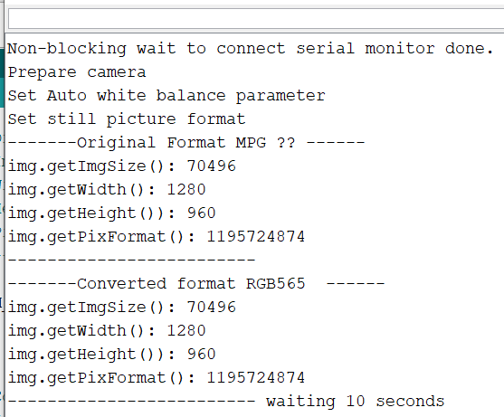

Not planning on doing a lot with the Spresense board but would really like to get the Arduino IDE with Edge Impulse Camera working.

Files he should be related

Data after running code [reserach/spre-image-data.ino](reserach/spre-image-data.ino)  

